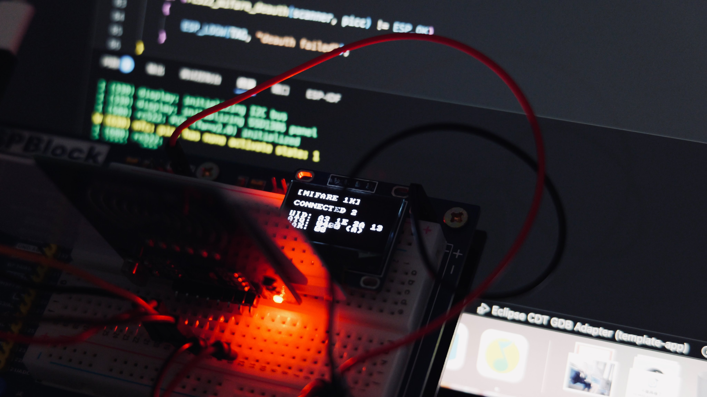

# ESP32 NFC Display Project

This project uses an ESP32 to implement an NFC card reader and display the information on an OLED screen.

## Features

*   Reads NFC card information using an RC522 module.
*   Displays card type, UID, and SAK information on an SSD1306 OLED screen.
*   Supports MIFARE Classic compatible cards.

## Tech Specs

**OLED Display (SSD1306)**

Connected via I2C:

*   SDA: GPIO 13
*   SCL: GPIO 14

**NFC Reader (RC522)**

Connected via SPI:

*   MISO: GPIO 19
*   MOSI: GPIO 23
*   SCLK: GPIO 18
*   SDA (CS/SS): GPIO 5
*   RST: Software Reset (No physical pin connected)
*   IRQ: Not used

**Font**

The `font8x8` font library used in this project is from [dhepper/font8x8](https://github.com/dhepper/font8x8).

**Dependencies**

*   ESP-IDF
*   ESP LCD component used in [main/display.c](main/display.c)
*   RC522 component used in [main/nfc.c](main/nfc.c)

## License

This project is licensed under the MIT License. See the [LICENSE](LICENSE) file for details.

---

Copyright (c) 2025 Lakr Aream. All rights reserved.
